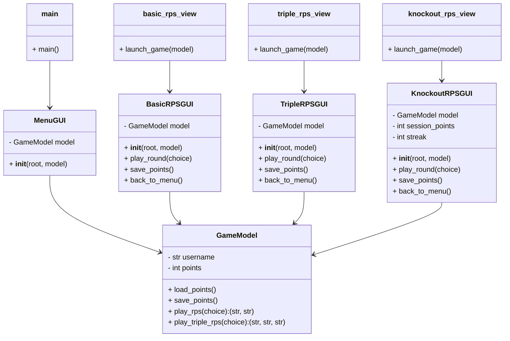

# Visual-Programming-Final-Project

Project Introduction:

  The application I have created for my final project is a Rock Paper Scissors program that runs three different versions of RPS. To clarify of the bat, I did use ChatGPT to assist in the creation of the program, but it was mainly to handle the brunt work of code creation. I am a big fan of applications like Worlde, and such on the New York Times Game website, that are quick, simple games that someone can boot up and play. So this program is like that but for Rock Paper Scissors, with a little added complexity to make it more then just Rock Paper Scissors. The Program contains three different versions, or as I call them, game modes of RPS for a single player to enjoy when pasting the time or waiting during a short span. 

Design and Architecture:

Instructions:

  To install the program you need six specific files to work together. There is the Main.py that lanuchs the program. Next is the model.py that stores the data. And then there are the four different View files that provide a different GUI each. There is the menu_view.py for the Menu GUI, the basic_rps_view.py for the normal Rock Paper Scissors game mode GUI, the triple_rps_view.py for the Triple Rock Paper Scissors game mode GUI, and finally the knockout_rps_view.py for the Knockout Rock Paper Scissors gamemode GUI.
  The key features of the RPS program are, as mentioned before, the three different game modes, and as not mentioned before, the point system. The three game modes are as follows; Basic Rock Paper Scissors, this is your regular game of RPS, Triple Rock Paper Scissors, this game mode involves two computers against the player, Knockout Rock Paper Scissors, this game mode involves a "double or nothing" system that rewards and punishes players for winning streaks and losing winning streaks. The point system is a form of reward for the player. When a player wins in each mode they are given points. In basic RPS, a win is 200 points. In Triple RPS, a win against both computers is 300 points, and a partial win, where the player ties with one computer and beats the other, gives 150 points. In Knockout RPS, a win intially gives 200 points, but every win in a streak gives double. But a lost in Knockout RPS with stop the streak and remove those points. The player can then save the points they earn in the game modes to a specific username to use later. Triple and Knockout RPS will only unlock for the player after certain point thresholds are reached. These being 1,000 points for Triple RPS and 5,000 points for Knockout RPS.

Challenges, Role of AI, Insights:

  A major problem that took a little trial and error was saving the total point value for a player. The issue was that while you would earn points in a game mode, when you would return to the menu the points would not save for the return. And while I'm not fully satisfied with my solution, I did end up solving the problem. Before the player returns back to the menu, they can now save their points inside the game modes with a "Save Points" button. And when they return to the menu, they log back in with their username and the points appear. Other problems involved the mechanics of Triple and Knockout RPS as they aren't normal RPS games. It was smaller things like creating the partial wins for Triple RPS, and the "double or nothing" system for Knockout RPS.
  I definity used AI to help out with this program. Specifically, I used ChatGPT to help with code creation and solving some of the problems I was encountering. It was very useful in stituations where I missed a typo or when I needed a bulk of code to be updated without messing up the systems that were already in place. I think that's been one of the most interesting things I have learned about programming recently. Getting better at utilizing AI as a consistent way to check that my code is still consistent across the broad. What usually creates issues in my code is when systems no longer match up across different files, so AI has been very nice is keeping that code on the rails.

Next Steps:

  If I had more time there are definity things that I would like to improve about the program. As I mentioned before, they are quirks about the point system that I wish could be fixed. An example is that when you return to the menu, you have to log back so that your points return and you are able to play the other modes. I would also improve the visuals of the program. I did not use flutter/dart for the project because I did not think I understood the systems well enough at the time. Most importantly, in the future I would almost definity add a multiplayer mode. I hold to the idea that if someone wanted to play RPS with another person than they would probably already be in the presence of another person. So, a single player program on a computer for someone to just quickly boot up and play, I think, makes more sense to begin with. But for a fuller package, multiplayer would be a nice extra feature. 
